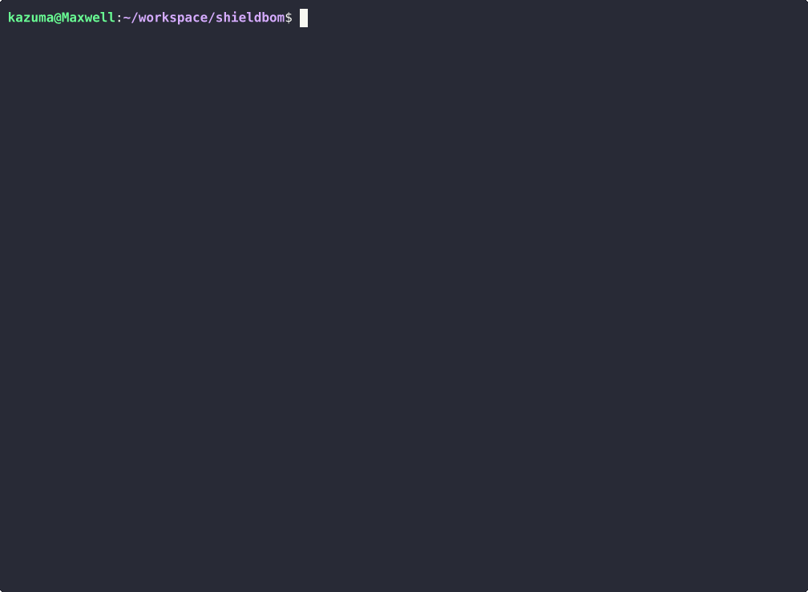

# ShieldBOM

**SBOM vulnerability scanner and license checker for embedded/IoT software.**

[](https://github.com/kazu11max17/shieldbom/actions)
[](https://crates.io/crates/shieldbom)
[](LICENSE)

---

<p align="center">
  
</p>

ShieldBOM parses SBOM files (SPDX, CycloneDX), matches components against known vulnerabilities, and detects license conflicts -- all from a single binary that works offline. Built for embedded and IoT teams who deal with C/C++ supply chains, cross-compiled dependencies, and air-gapped build environments.

## Features

- **SBOM parsing** -- SPDX 2.3 (JSON, Tag-Value) and CycloneDX 1.4/1.5 (JSON, XML)
- **Vulnerability matching** -- CPE-based lookup against NVD/OSV data with CVSS severity scoring
- **License conflict detection** -- Flags known-incompatible combinations (e.g., GPL-3.0 + proprietary)
- **Multiple output formats** -- Human-readable table, JSON, and SARIF 2.1.0
- **Offline-first** -- Download a vulnerability DB snapshot once, scan without network access
- **Single binary** -- No runtime dependencies; works on Linux, macOS, and Windows
- **Non-zero exit codes** -- Fails the build when policy violations are found (severity threshold configurable)

## Supported Formats

| Standard | Versions | File Types |
|----------|----------|------------|
| SPDX | 2.3 | `.spdx.json`, `.spdx` (Tag-Value) |
| CycloneDX | 1.4, 1.5 | `.cdx.json`, `.cdx.xml` |

## Quick Start

### Installation

```bash
cargo install shieldbom
```

Or build from source:

```bash
git clone https://github.com/kazu11max17/shieldbom.git
cd shieldbom
cargo build --release
# Binary is at ./target/release/shieldbom
```

### First scan

```bash
# Scan any SPDX or CycloneDX file you already have
shieldbom scan your-product.spdx.json

# Or try the included examples (if you cloned the repo)
git clone https://github.com/kazu11max17/shieldbom.git
shieldbom scan shieldbom/examples/smart-gateway-firmware.spdx.json
```

Example output (scanning a sample IoT gateway firmware SBOM):

```
$ shieldbom scan examples/smart-gateway-firmware.spdx.json

ShieldBOM Scan Results
File: examples/smart-gateway-firmware.spdx.json
Format: SPDX 2.3 (JSON)
Components: 9

  0 Critical  0 High  0 Medium  0 Low

License Issues
--------------------------------------------------------------------------------
  [Copyleft] busybox @ 1.36.0 - Copyleft license 'GPL-2.0-only' detected
             - may conflict with proprietary distribution
```

By default, ShieldBOM queries [OSV.dev](https://osv.dev/) for vulnerabilities. For offline/air-gapped environments:

```bash
shieldbom db update           # Download vulnerability DB (once)
shieldbom scan --offline product.spdx.json
```

## Usage

### `scan` -- Analyze an SBOM for vulnerabilities and license issues

```bash
# Basic scan (table output, severity >= medium)
shieldbom scan product.spdx.json

# JSON output for CI pipelines
shieldbom scan product.spdx.json --format json

# SARIF output for GitHub Code Scanning / IDE integration
shieldbom scan product.cdx.xml --format sarif > results.sarif

# Only fail on critical/high severity
shieldbom scan product.cdx.json --severity high

# Fully offline scan with a specific DB path
shieldbom scan product.spdx.json --offline --db /path/to/vuln.db
```

### `validate` -- Check SBOM format and completeness

```bash
shieldbom validate vendor-sbom.cdx.json
```

### `db` -- Manage the local vulnerability database

```bash
# Download or update the vulnerability database
shieldbom db update

# Show database status
shieldbom db info
```

### Exit codes

| Code | Meaning |
|------|---------|
| 0 | No issues found above the severity threshold |
| 1 | Vulnerabilities or license conflicts detected |
| 2 | Input error (malformed SBOM, missing file) |

## Output Formats

**Table** (default) -- Human-readable summary in the terminal with severity counts and affected components.

**JSON** (`--format json`) -- Structured report for downstream tooling and dashboards.

**SARIF** (`--format sarif`) -- SARIF 2.1.0 for integration with GitHub Code Scanning, VS Code, and other SARIF-compatible tools.

## Why ShieldBOM?

Most SCA tools are built for web applications and container ecosystems. If you work with embedded software, you already know the gaps:

- **C/C++ supply chains are invisible.** Package managers like Conan and vcpkg have limited SBOM support. Vendor-provided binaries ship with no metadata. Most tools assume npm/pip/Maven dependency trees exist.
- **Air-gapped environments are common.** Factory build servers, automotive CI systems, and classified environments cannot phone home to a cloud API on every build.
- **Cost is a barrier.** Commercial tools with real embedded coverage are priced for large enterprises. ShieldBOM's core functionality is free and open source.

ShieldBOM is built for this reality: offline-first, single binary, no runtime dependencies, and focused on the formats and workflows embedded teams actually use.

### EU Cyber Resilience Act (CRA)

The [EU Cyber Resilience Act (Regulation 2024/2847)](https://eur-lex.europa.eu/eli/reg/2024/2847/oj/eng) entered into force on 10 December 2024. The Article 14 obligation to report actively exploited vulnerabilities and severe incidents applies from **11 September 2026**, and the main manufacturer obligations apply from **11 December 2027**.

The regulation requires manufacturers to identify and document vulnerabilities and components of products with digital elements, including by drawing up an SBOM (Annex I, Part II). ShieldBOM assists with part of this work — specifically, the SBOM-based vulnerability identification and component documentation requirements. Full CRA compliance involves additional obligations beyond what any single tool can address.

`--format cra` renders an HTML report that maps your SBOM analysis onto CRA Annex I references, including a conformity checklist with the evidence behind each Pass/Fail:

```bash
shieldbom scan sbom.spdx.json --format cra \
  --product-name "Smart Gateway" \
  --product-version "2.4.1" \
  --manufacturer "Acme Industrial GmbH" \
  --support-period "5 years from 2026-01-01" \
  --update-mechanism "Signed OTA updates over HTTPS" \
  > cra-report.html
```

The CRA options are optional, but if any of `--product-name`, `--product-version` or `--manufacturer` is missing, the CLI warns you and the report itself carries a **DRAFT — NOT FOR COMPLIANCE USE** banner. A report without product identification cannot serve as technical documentation under Annex VII.

**This report is an input to your compliance work, not a conformity assessment.** Conformity assessment is a legal procedure under Article 32 and Annex VIII, carried out by the manufacturer or a notified body — not by a tool. The report states this on its face, not just here.

Statuses are deliberately conservative:

| Status | Meaning |
|--------|---------|
| `PASS` | Determinable from the SBOM and satisfied |
| `FAIL` | Determinable from the SBOM and not satisfied |
| `REVIEW` | Findings exist that this tool cannot adjudicate — you decide |
| `N/A` | Not determinable from an SBOM; requires manufacturer attestation |

Two consequences worth knowing:

- **Severity is not exploitability.** Annex I, Part I, point (2)(a) concerns *known exploitable* vulnerabilities, so a `PASS` is only issued when no known vulnerabilities remain. Anything listed in the [CISA KEV catalogue](https://www.cisa.gov/known-exploited-vulnerabilities-catalog) is a `FAIL`; other findings are `REVIEW`.
- **Running a scan is not a process.** "Vulnerability handling process in place" is always `N/A`. Annex I, Part II requires remediation without delay and regular testing, which no single scan demonstrates.

## Roadmap

| Phase | Focus | Status |
|-------|-------|--------|
| **Phase 1** | OSS CLI: SBOM parsing, vulnerability matching, license checks, EU CRA reports | **Released** |
| **Phase 2** | Embedded specialization: Yocto/Buildroot integration, binary matching | In progress |
| **Phase 4** | SaaS dashboard, CI/CD integration (GitHub Actions, GitLab CI) | Planned |
| **Phase 5** | Platform: fuzzing integration, SARIF aggregation, binary-to-SBOM generation | Planned |

(Phase 3 is customer validation, which runs alongside Phase 2 and ships nothing.)

### Current limitations

- No binary/firmware SBOM generation yet (Phase 5)
- License conflict rules are a built-in set; custom policies are not yet supported
- CRA report metadata is passed per invocation; there is no stored product profile yet
- No web UI or team features (Phase 4)

## Contributing

Contributions are welcome. Here is how to get started:

```bash
git clone https://github.com/kazu11max17/shieldbom.git
cd shieldbom
cargo build
cargo test
```

Before submitting a PR:

1. Run `cargo fmt` and `cargo clippy`
2. Add tests for new functionality
3. Keep commits focused -- one logical change per commit

If you are unsure whether a change fits the project direction, open an issue first to discuss.

## License

Licensed under the Apache License, Version 2.0. See [LICENSE](LICENSE) for details.

### Contribution

Unless you explicitly state otherwise, any contribution intentionally submitted for inclusion in this project by you, as defined in the Apache-2.0 license, shall be licensed under the same terms, without any additional terms or conditions.
